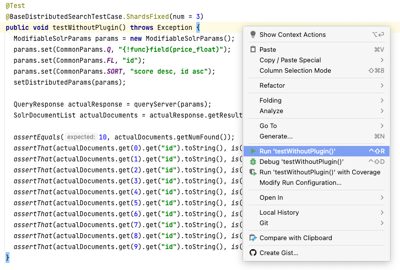
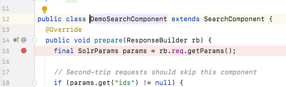
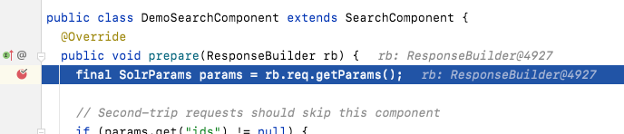

# 0. 準備

具体的なSolrの動作や題材のプラグインの内容を説明する前に、本章では、本リポジトリのコードをIDEで開いて追う方法と、プラグインをSolrにインストールし利用する方法を説明します。


## 本リポジトリのコードをクローンする

まず、本リポジトリのコードをGitでローカルにクローンします。
Gitについては、本チュートリアルでは詳細には説明しません。

```
git clone git@github.com:yahoojapan/solr-plugin-samples.git
```


## 本リポジトリのコードをIntelliJで開き、Mavenでパッケージングする

今後の説明を理解するために、コードがいつでも読めたほうが良いので、本プラグインのコードをIntelliJ IDEA（以下、単にIntelliJ）で開いておきましょう。

IntelliJのダウンロードとインストールについても、本チュートリアルでは説明しませんので、[公式サイト](https://www.jetbrains.com/ja-jp/idea/)を参照してください。

ここでは、IntelliJ IDEA (Community Edition) Mac版を題材に説明します。


### 本リポジトリのコードを開く

IntelliJを起動すると、プロジェクトの選択の画面になります。
ここでOpenをクリックします。


**クローンしてきた先のディレクトリ**を選択し、再度Openをクリックします。

Trust and Open Maven Project? と聞かれた場合は、Trust Projectをクリックします（本来は、[pom.xml](../pom.xml)を精査してからクリックすべきです）。


### 単体テストの実行

コードが正常にオープンできているかを調べるために、テストを実行してみます。

<!-- TODO: 公開時、社外でのパッケージ名に書き換える -->
テストを実行するには、テストコードをエディタで開く必要があります。
左ペインの `Project` タブから、ディレクトリ構造を例えば
`solr_demo_plugin` > `src` > `test` > `java` > `jp.co.yahoo.solr.demo` > `DemoSearchComponentTest` と辿り、ダブルクリックすると当該のテストクラスをエディタで開くことができます。

実行したいテストケースにキャレットを置き、右クリックメニューから `Run` をクリックするとテストケースを実行することができます。



左下のペインにテスト結果が、右下にコンソール出力が表示されます。


### ブレークポイントの設定

コードにブレークポイントを置き、テストケースを**デバッグモードで**実行することで、そのテストケースの実行において、コードが意図した順序で実行されているか確かめることができます。

ブレークポイントを置くには、コードの行頭（下図の赤丸の箇所）をクリックします。
ブレークポイントの印として赤丸がつきます。



単体テストを**デバッグモードで**実行するには、実行したいテストケースにキャレットを置き、右クリックメニューから `Debug`（`Run` の下）をクリックします。
ブレークポイントを置いた行が実行される**直前**に、実行が停止し、その行がハイライトされます。



このとき、左下ペインにはスタックトレースが表示され、各項目をクリックすると、対応するコードにジャンプすることができます。
右下のペインからローカル変数の内容なども見ることができます。
次のブレークポイントまで実行するときは左下ペインから再生マーク（緑三角）を押します。
実行を停止する時は停止マーク（赤四角）を押します。


### パッケージング

ここまでコードを読みテストを実行してきましたが、Solrでコードを実行するにはパッケージングして配置する必要があります。
本リポジトリのコードをパッケージングするには、ビルドツールMavenを利用します。
IntelliJにはMavenがバンドルされているため、ここではIntelliJでパッケージングする方法を説明します。

IntelliJでMavenを利用してパッケージングするには、右ペインのMavenタブから `solr_demo_plugin` > `Lifecycle` > `package` をダブルクリックします。
全てのテストケースをパスすれば、クローンしてきた先のディレクトリ以下、`target` ディレクトリに、.jarファイルが生成されます。


### その他の便利な機能

- `Shift` の2度押しで検索窓が開き、クラス名、メソッド名、変数名などで検索が可能です。
- 識別子にキャレットを置いた状態で、`Command` と `b` の同時押しで、その定義にジャンプします。また、定義の識別子（変数宣言の変数名、メソッド定義のメソッド名など）にキャレットを置いた状態で、`Command` と `b` の同時押しで、その使用箇所の一覧が出ます。
- `Command` と `[` の同時押しで、ジャンプの前に戻ります。`Command` と `]` の同時押しは、その逆です。


## 題材のプラグインをインストールする

続いて、題材のプラグインをSolrにインストールして動作させてみましょう。

本チュートリアルはSolrのプラグイン開発に関するものですので、お読みの方が既にお使いのSolrが存在する想定で進めます。
もし存在しない場合は、[Solr公式のDockerイメージを動かす](https://solr.apache.org/guide/solr/latest/deployment-guide/solr-in-docker.html)などの方法で準備してください。


### パッケージの配置

前節で本リポジトリのコードをパッケージングする方法を紹介し、その成果物は.jarファイルでした。
プラグインをSolrにインストールするには、まず、同ファイルをSolrのクラスパスが通ったディレクトリに配置する必要があります。

Solrコアごとのクラスパスが通ったディレクトリは、設定ファイル `solrconfig.xml` で指定できます。
[デフォルト](https://github.com/apache/lucene-solr/blob/branch_7_3/solr/server/solr/configsets/_default/conf/solrconfig.xml#L75)では例えば以下の指定があります。

```xml
  <lib dir="${solr.install.dir:../../../..}/contrib/extraction/lib" regex=".*\.jar" />
```

> このように `solrconfig.xml` でSolrコアごとのクラスパスが通ったディレクトリを指定できるほか、`solr.xml` の `sharedLib` でJVMごとのクラスパスが通ったディレクトリを指定することもできます。
> クラスパスを有効にするには、前者の場合、この後に示すように、SolrコアをRELOADする必要があります。
> 後者の場合、JVMごと再起動する必要があります。


### プラグインごとの設定

前項の手順により、Solrから本リポジトリのコードが読めるようになりました。
実際に動作させるにはプラグインごとに追加の設定も必要です。
例えば題材のプラグインは `SearchComponent` を起点に動作しますので、引き続き `solrconfig.xml` で `searchComponent` の宣言をします。
以下の指定により、`/select`エンドポイントに来た検索リクエストに対して、独自の `DemoSearchComponent` を動作させます（[本リポジトリ内、テスト用のsolrconfig.xml](../src/test-files/solr/collection1/conf/solrconfig.xml)より抜粋）。

```xml
  <searchComponent name="demoComponent" class="jp.co.yahoo.solr.demo.DemoSearchComponent"/>

  <requestHandler name="/select" class="solr.SearchHandler">
    <arr name="last-components">
      <str>demoComponent</str>
    </arr>
  </requestHandler>
```

これらの配置と設定をした後、SolrコアをRELOADするとプラグインをインストールしたことになります。

> SolrCloudモードで複数のサーバにある複数のSolrコアが協調動作している場合は、すべてのサーバに.jarを配置する必要があります。
> ZooKeeper上の `solrconfig.xml` を変更し、コレクションをRELOADすると、全てのコアに新しい `solrconfig.xml` が反映され、全てのコアがRELOADされるはずです。


### SolrのAdmin UIで `SearchComponent` を確認

プラグインの起点が `SearchComponent` の場合は、SolrのAdmin UIからインストールを確認できます。
Solrコアごとのメニューから、`Plugins / Stats` > `OTHER` と進みます。
インストールできていれば、`solrconfig.xml` でつけた `searchComponent` の `name`（前述の例では `demoComponent`）が表示されるはずです。


## 題材のプラグインの外部仕様と動作確認

これで題材のプラグインを動作させる準備が整いました。
実際に動かしてみますが、まず、題材のプラグインの外部仕様を確認します。

### リクエストの仕様

通常のSolrの検索リクエストに加えて、以下の2つのリクエストパラメータを追加することにします。

| パラメータ名           | 説明                                                                    |
|------------------|-----------------------------------------------------------------------|
| `demo.field.name`  | フィールド名。`docValues="true"` かつ `multiValued="false"` の数値型フィールドである必要がある。 |
| `demo.field.value` | フィールド値。                                                               |

追加後の検索リクエストの例：`q=HDDケース&demo.field.name=price&demo.field.value=2600`


### レスポンスの仕様

前述のリクエストパラメータをどちらも追加しない場合は、通常のレスポンスが返ります。

前述のリクエストパラメータを共に追加した場合は、検索結果のドキュメントを、指定の名前のフィールドの値が指定の値と一致するものが上位に、しないものが下位に来るように並べ替えるものとします。
ただし、一致するドキュメント同士、しないドキュメント同士、それぞれの間では、元の順序を維持する（言い換えると、安定ソートを行う）ものとします。


### 動作確認（動作例）

実際の動作確認は、SolrのAdmin UIのコアごと（SolrCloudモードの場合はコレクションごと）のメニューから `Query` のページに進んで、そこから行うと良いでしょう。

通常の検索リクエスト、例えば `q=HDDケース`、ソート条件は安い順（同一価格の場合はID順）に対するレスポンスの例が下表の左です。

題材のプラグインが有効な検索リクエスト、例えば `q=HDDケース&demo.field.name=price&demo.field.value=2600` に対しては、ソート条件は同じでも例えば下表の右のレスポンスが返ります。
題材のプラグインを有効にした場合は、`price` フィールドの値が `2600` と一致するドキュメントが最も上位に来ていることが分かります。
また、一致するドキュメント同士、しないドキュメント同士、それぞれの間では、安い順（およびID順）が保たれています。

<table><tr><td>

```json
{
  "responseHeader":{
    "status":0,
    "QTime":20},
  "response":{"numFound":10,"start":0,"docs":[
      {
        "id":"4",
        "price":"680"},
      {
        "id":"9",
        "price":"780"},
      {
        "id":"2",
        "price":"980"},
      {
        "id":"8",
        "price":"1380"},
      {
        "id":"5",
        "price":"1880"},
      {
        "id":"0",
        "price":"2600"},
      {
        "id":"1",
        "price":"2600"},
      {
        "id":"7",
        "price":"2600"},
      {
        "id":"6",
        "price":"2880"},
      {
        "id":"3",
        "price":"3500"}]
  }}
```

</td><td>

```json
{
  "responseHeader":{
    "status":0,
    "QTime":24},
  "response":{"numFound":10,"start":0,"docs":[
      {
        "id":"0",
        "price":"2600"},
      {
        "id":"1",
        "price":"2600"},
      {
        "id":"7",
        "price":"2600"},
      {
        "id":"4",
        "price":"680"},
      {
        "id":"9",
        "price":"780"},
      {
        "id":"2",
        "price":"980"},
      {
        "id":"8",
        "price":"1380"},
      {
        "id":"5",
        "price":"1880"},
      {
        "id":"6",
        "price":"2880"},
      {
        "id":"3",
        "price":"3500"}]
  }}
```

</td></tr></table>
