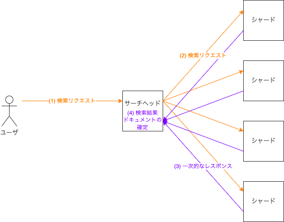
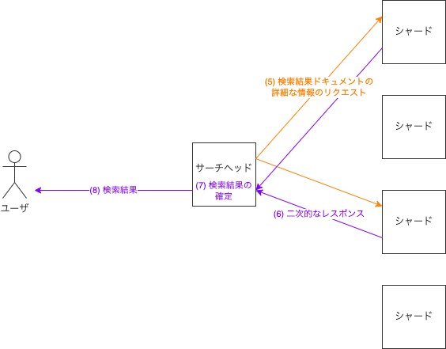

# 1. プラグインの動作の起点をつくる (`SearchComponent`)

プラグインを動作させるためには、自作のコードをSolrに呼び出してもらう必要があります。
そして、[プラグインごとの設定の項](./0_preliminary.md#プラグインごとの設定)で説明した通り、題材のプラグインの場合は、`SearchComponent` が自作のコードの呼び出しの起点でした。
本章では、この `SearchComponent` について説明します。


## `SearchComponent` の基本

`SearchComponent` 抽象クラスは `solr-core` パッケージで提供されています。
ですので、`SearchComponent` を使用するSolrプラグインは、`solr-core` パッケージに依存することになります。
本リポジトリではビルドツールとしてMavenを採用しており、[本リポジトリのpom.xml（Mavenの設定ファイル）](../pom.xml)でいうと以下の箇所で依存を宣言しています。

```xml
    <dependency>
      <groupId>org.apache.solr</groupId>
      <artifactId>solr-core</artifactId>
      <version>${apache.solr.version}</version>
    </dependency>
```

`SearchComponent` の各所に書いたコードは、Solrが検索リクエスト処理の各所で呼び出します。
具体的な呼び出し元は、`SearchHandler#handleRequestBody`（[ソースコード](https://github.com/apache/lucene-solr/blob/branch_7_3/solr/core/src/java/org/apache/solr/handler/component/SearchHandler.java#L248)）です。


## Solrの検索リクエスト処理の基本

本節では、Solrの検索リクエスト処理の基本を追いながら、どこでSolrが `SearchComponent` のメソッドを呼ぶかを説明します。


### SearchComponentの順序

準備として、一般に `SearchComponent` は複数あり、その間には順序があることについて説明します。
以下、単に「`SearchComponent` の特定のメソッドを呼ぶ」と言うときは、この順序で各 `SearchComponent` の同名のメソッドを次々に呼ぶことを指します。
この順序は、具体的には以下の通りです：

1. `solrconfig.xml` で指定した `first-components`
2. デフォルトの `SearchComponent` 群。特に、デフォルトの検索リクエスト処理を担当する ` QueryComponent` を含む
3. 同じく指定した `last-components`

> また、デフォルトの `SearchComponent` 群を使わずに、全ての `SearchComponent` を `solrconfig.xml` の `components` で明示的に指定することもできます。

このあたりは本ドキュメントでは詳しく説明しませんが、[公式ドキュメント](https://solr.apache.org/guide/7_3/requesthandlers-and-searchcomponents-in-solrconfig.html#RequestHandlersandSearchComponentsinSolrConfig-SearchComponents)で詳しく説明されています。


### 通常の場合

ではSolrが `SearchComponent` のメソッドを呼び出す順序について説明します。
まず、検索対象の全てのドキュメントが単一のコアに保存されており、検索リクエストの処理が単一のコアで完結する場合の動作です。
Solrは以下の順でメソッドを呼び出します。

- `SearchComponent#prepare`
- `SearchComponent#process`

例えば、`QueryComponent` と `DemoSearchComponent` だけが、この順で指定されている場合、Solrは以下の順でメソッドを呼びます。

- `QueryComponent#prepare`
- `DemoSearchComponent#prepare`
- `QueryComponent#process`
- `DemoSearchComponent#process`


### 複数シャード構成の場合

続いて、検索対象のドキュメントが複数のコアに分割されて保存されており（論理的には複数のシャードに分割されており）、複数のコア（通常、複数のサーバに対応する）で検索リクエストの処理を行う場合の動作です。
この場合、かなり複雑な動作になります。

大局的に見た動作から説明します。
まず、ユーザからの検索リクエストが、いずれか一台のサーバへ届きます。
以下このサーバを、このチュートリアル独自の用語で**サーチヘッド**と呼びます。
以下の順序で処理が進みます：

1. ユーザがサーチヘッドへ検索リクエストを送る
2. サーチヘッドが各シャード1つずつのコア（以下、単にシャード）へ検索リクエストを分散して送る
3. 各シャードがサーチヘッドへ一次的なレスポンス（ドキュメントIDと、ドキュメントのソートに必要な情報）を返す
4. サーチヘッドが各シャードからの一次的なレスポンスをマージし、検索結果に含めるドキュメント（以下、検索結果ドキュメント）が確定する
5. サーチヘッドが検索結果ドキュメントを持っている各シャードへ、検索結果ドキュメントの詳細な情報のリクエストを送る
6. 各シャードがサーチヘッドに二次的なレスポンス（検索結果を生成するのに必要な全ての情報）を返す
7. サーチヘッドが各シャードからの二次的なレスポンスをマージし、検索結果が確定する
8. サーチヘッドがユーザへ検索結果を返す

図示すると以下の通りです。
ただし一般には、サーチヘッドがシャードを兼ねることもありますが、ここでは単純化のために分けました。





サーチヘッドとシャードの間で複数回のリクエスト/レスポンスが行われますが、これは `SearchHandler` が**ステージ** (実体は `int` で、ありうるステージは [`ResponseBuilder` に定数として定義](https://github.com/apache/lucene-solr/blob/branch_7_3/solr/core/src/java/org/apache/solr/handler/component/ResponseBuilder.java#L123-L128)されている) を進めながら処理を繰り返すことで実現しています。
例えば検索結果ドキュメントを確定するステージ `STAGE_EXECUTE_QUERY` や、検索結果を確定するステージ `STAGE_GET_FIELDS` があるわけです。
`SearchComponent` のメソッドの呼び出しの順序に注目して説明すると、以下の通りです：

- サーチヘッドにおける `SearchComponent#prepare`
- **ステージごとに**：
  - サーチヘッドにおける `SearchComponent#distributedProcess`
  - 各シャードにおける：
    - `SearchComponent#prepare`
    - `SearchComponent#process`
  - サーチヘッドにおける：
    - `SearchComponent#handleResponses`
    - `SearchComponent#finishStage`

> ただし、[`SearchHandler` における以下のコメント](https://github.com/apache/lucene-solr/blob/branch_7_3/solr/core/src/java/org/apache/solr/handler/component/SearchHandler.java#L392-L394)の通り、この順序には例外もあります。
>```java
>          // now wait for replies, but if anyone puts more requests on
>          // the outgoing queue, send them out immediately (by exiting
>          // this loop)
>```


## DemoSearchComponentにおける実装の例

では、ここからは `DemoSearchComponent`（[ソースコード](../src/main/java/jp/co/yahoo/solr/demo/DemoSearchComponent.java)）における実装を説明します。

前述の通り `SearchComponent` には色々なメソッドがありますが、[題材のプラグインの外部仕様](./0_preliminary.md#題材のプラグインの外部仕様と動作確認)は、`SearchComponent#prepare` のみ実装すれば満たすことができます。

しかし、これも前述の通り、Solrは `SearchComponent#prepare` を色々なタイミングで呼び出します。
ですので、`DemoSearchComponent#prepare` の実装では、どのタイミングで呼び出されたかを判定して、処理を分岐しています：

- 通常の場合、`RankQuery` によるドキュメントの並べ替え（詳細は[検索結果上位のドキュメントを並べ替える](./2_rank_query.md)参照）を行うための準備をする
- 複数シャード構成の場合の：
  - サーチヘッドにおける呼び出しでは、検索結果ドキュメントの確定時に、各シャードから `docValues` を受け取り、その内容によりドキュメントの並べ替えを行うための準備をする（詳細は[ドキュメントのフィールド値にアクセスする](./3_doc_values.md)参照）
  - 検索結果ドキュメントを確定するためのステージにおける、各シャードにおける呼び出しでは、サーチヘッドに `docValues` を返すための準備をする（これも詳細は[ドキュメントのフィールド値にアクセスする](./3_doc_values.md)参照）
  - 検索結果を確定するためのステージにおける、各シャードにおける呼び出しでは、何もしない

それぞれの分岐については、今後の章で詳しく説明します。
ここでは上述の判定について詳しく説明します：

- まず、検索結果を確定するためのステージにおける呼び出しでは、検索結果ドキュメントのID列が確定しているので、リクエストパラメータに `ids` が追加されています。
- 次に、サーチヘッドにおける呼び出しでは、`ResponseBuilder#isDistributed` が `true` を返します。
- 次に、各シャードにおける呼び出しでは、リクエストパラメータに `ShardParams.IS_SHARD` が追加されています。
- いずれにも該当しないなら、通常の場合です。

以上の判定と、処理の分岐を、`DemoSearchComponent#prepare` では以下のように実装しています。

```java
  public void prepare(ResponseBuilder rb) {
    final SolrParams params = rb.req.getParams();

    // Second-trip requests should skip this component
    if (params.get("ids") != null) {
      return;
    }
    ...
    if (rb.isDistributed()) {  // This is a request for multiple shards. This node merges multiple per-shard responses.
      if (rb.getMergeStrategies() != null && 0 < rb.getMergeStrategies().size()) {
        throw new SolrException(SolrException.ErrorCode.INVALID_STATE,
                                "Other components merging per-shard responses conflicts with this demo plug-in.");
      }
      // Set the strategy for the merging
      rb.addMergeStrategy(demoMergeStrategy);
    } else {  // This is a request for one shard. This node generates a per-shard response.
      if (null == params.get(ShardParams.IS_SHARD)) {  // This collection consists of only one shard.
        RankQuery demoRankQuery = new DemoRankQuery(demoMergeStrategy, demoContext);
        rb.setRankQuery(demoRankQuery);  // Set RankQuery for deduping at generation of the per-shard response
      } else {  // This collection consists of multiple shards.
        rb.mergeFieldHandler = demoMergeStrategy;  // Return docValues for deduping at merging
      }
    }
  }
```

`DemoSearchComponent#prepare` では、他にリクエストパラメータをパースし、結果をコンテキストオブジェクト (`DemoContext`) に詰める処理も行っています。
特に、題材のプラグインを動作させるためのリクエストパラメータが何も指定されていない場合は、何もせずにearly returnしています。これにより、リクエスト時のプラグインのオンオフが実現します。
その他は、`SearchComponent` の動作としては本質的ではないので、ここでの説明は省略します。


## `SearchComponent` のテスト

これまで `SearchComponent` の実装について説明してきましたが、本節では `SearchComponent` のテストについて説明します。
前述の通り `SearchComponent` はプラグインの動作の起点になるので、そのテストはプラグイン全体のテストにもなります。
題材のプラグインは検索結果のドキュメントの順序に影響しますので、実際に題材のプラグインをインストールしたSolrやSolrCloudを立て、リクエストを投げて、レスポンスをアサートできれば良さそうです。
`solr-test-framework` パッケージには、このようなテストのためのクラスが用意されています。
通常の場合と複数シャード構成の場合で、利用すべきクラスと使用法が異なるため、分けて説明します。


## 通常の場合

`RestTestBase` を使用します。
使用例は `DemoSearchComponentSingleShardTest`（[ソースコード](../src/test/java/jp/co/yahoo/solr/demo/DemoSearchComponentSingleShardTest.java)）を参照してください。


### Solrの立ち上げ

Solr homeになるディレクトリを切り、設定ファイルをコピーします。
同ディレクトリを指定して `createJettyAndHarness` を呼び出すとSolrが立ち上がります。

```java
    File testHome = createTempDir().toFile();
    FileUtils.copyDirectory(getFile("solr"), testHome);

    createJettyAndHarness(testHome.getAbsolutePath(), "solrconfig.xml", "schema.xml", "/solr", true, null);
```

設定ファイルのコピー元は、本リポジトリでは[../src/test-files/solr](../src/test-files/solr)です。


### ドキュメントの送信

`adoc` でドキュメントを生成します。
引数はフィールド名、フィールド値、を交互に繰り返しです。
`assertU` でドキュメントを送信し、成功したことをアサートします。

```java
    assertU(adoc("id", "0", "price", "2600"));
```

ドキュメントを送信した後、検索可能にするためにコミット命令を送信します。

```java
    assertU(commit());
```


### 検索リクエストの生成

`SolrQuery` オブジェクトを生成します。
その後、`SolrQuery#add` でリクエストパラメータを追加します。

```java
    SolrQuery query = new SolrQuery();
    query.add(CommonParams.Q, "{!func}field(price_float)");
    query.add(CommonParams.FL, "id");
    query.add(CommonParams.SORT, "score desc, id asc");
    query.add(DemoParams.DEMO_FIELD_NAME, "price_int");
    query.add(DemoParams.DEMO_FIELD_VALUE, "2600");
```


### 検索リクエストの送信とレスポンスのアサート

文字列化した検索リクエストを `assertJQ` で送信し、独自の記法でレスポンスをアサートします。

```java
    assertJQ("/select" + query.toQueryString(),
             "/response/numFound==10",

             // Documents which have the specified field value
             "/response/docs/[0]/id=='0'",
             ...
```

例では、レスポンスのJSONの `/response/numFound` 要素（ヒット件数）が数値の `10` であることと、検索結果ドキュメントの（0はじまりで）0件目のIDが文字列の `0` であることをアサートしています。


### 異常系のテスト

異常系のテストのためには、例えばレスポンスに含まれるエラーメッセージをアサートします。

```java
    assertJQ("/select" + query.toQueryString(),
             "/error/msg=='Unsupported docValues type: SORTED'");
```


## 複数シャード構成の場合

`BaseDistributedSearchTestCase` を使用します。
使用例は `DemoSearchComponentTest`（[ソースコード](../src/test/java/jp/co/yahoo/solr/demo/DemoSearchComponentTest.java)）を参照してください。


### Solrの立ち上げ

本リポジトリでは[../src/test-files/solr](../src/test-files/solr)に設定ファイルを配置していました。
この場合、単に `initCore` を呼べばSolrCloudが立ち上がります。

```java
    initCore("solrconfig.xml", "schema.xml");
```

シャード数はテストケースごとにアノテーションで指定します。

```java
  @Test
  @BaseDistributedSearchTestCase.ShardsFixed(num = 3)
  public void testWithPlugin() throws Exception {
    ...
```


### ドキュメントの送信

`index` でドキュメントの生成と送信、`commit` でコミットを行います。

```java
    index("id", "9", "price", "780");
    commit();
```


### 検索リクエストの生成

`ModifiableSolrParams` オブジェクトを生成します。
`setDistributedParams` で送信先のシャード名もクエリに含めます。

```java
    ModifiableSolrParams params = new ModifiableSolrParams();
    params.set(CommonParams.Q, "{!func}field(price_float)");
    params.set(CommonParams.FL, "id");
    params.set(CommonParams.SORT, "score desc, id asc");
    params.set(DemoParams.DEMO_FIELD_NAME, "price_int");
    params.set(DemoParams.DEMO_FIELD_VALUE, "2600");
    setDistributedParams(params);
```


### 検索リクエストの送信とレスポンスのアサート

`queryServer` でクエリを送信し、レスポンスを `QueryResponse` オブジェクトで受け取ります。
以下、`QueryResponse` を起点にフィールド値などを取得し、アサートします。

```java
    QueryResponse actualResponse = queryServer(params);
    SolrDocumentList actual = actualResponse.getResults();

    assertEquals(10, actual.getNumFound());

    // Documents which have the specified field value
    assertThat(actual.get(0).get("id").toString(), is("0"));
```


### 異常系のテスト

`queryServer` が例外を生じるので、例えばJUnitの `ExpectedException` で受け、アサートします。

```java
  @Rule
  public ExpectedException expectedException = ExpectedException.none();

  @Test
  @ShardsFixed(num = 3)
  public void testNoFieldName() throws Exception {
    expectedException.expect(HttpSolrClient.RemoteSolrException.class);
    expectedException.expectMessage("Only demo.field.name or demo.field.value is specified.");

    ModifiableSolrParams params = new ModifiableSolrParams();
    params.set(CommonParams.Q, "*:*");
    params.set(DemoParams.DEMO_FIELD_VALUE, "2600");
    setDistributedParams(params);

    queryServer(params);
  }
```


## 参考文献

- [RequestHandlers and SearchComponents in SolrConfig | Apache Solr Reference Guide 7.3](https://solr.apache.org/guide/7_3/requesthandlers-and-searchcomponents-in-solrconfig.html)
- [分散top-k検索の仕組みとSolrにおける実装 - Qiita](https://qiita.com/tomanabe/items/7ea6aaba4dda85d12ca2)
