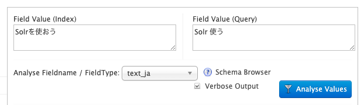

# 7. 文字列処理を変更する

本プラグインの動作について押さえておくべき最後のポイントは文字列処理です。
本プラグインには、`float[]` をBase64エンコードした文字列でベクトルを入力するためです。

本章では、まず、Solrによる文字列処理の基本を説明します。
次に、本プラグインにおける実装を説明します。

## Solrによる文字列処理

本節では、Solrによる文字列処理の基本を説明します。

### トークンと属性

検索エンジンによる文字列処理の基本はトークナイズです。
これは文字列を**トークン**という単位に分割する処理です。

各トークンには共通する複数の**属性**があります。
たとえば日本語の文を形態素解析して得たトークンであれば、表層形はもちろん、原形、品詞などの属性があり得ます。
通常、検索エンジンでも、これらの属性を扱います。
表層形ではなく原形でマッチさせたい、このとき品詞によっては無視したい、といった需要があるためです。
マッチとは、実装としてはドキュメントのフィールド中のトークンとクエリ中のそれの一致をみることです。
例えばドキュメントのタイトル「Solrを使おう」に対して、クエリ「Solr 使う」をマッチさせたいわけです。

### Analysis Screen

SolrのWeb UIにはanalysis screenがあり、Solrによる文字列処理の挙動を観察できます。



例えば `Index`（ドキュメント）側に「Solrを使おう」、`Query` 側に「Solr 使う」を入力します。
片側でも観察できますが、両側を入力するとマッチするトークンがハイライトされます。
この状態で、`FieldType` はデフォルトの `schema.xml` に存在する `text_ja` について `Analyse Values` してみます。
`Verbose Output` はチェックしてください。

Index側について、おおむね以下のような出力がされます。
（実際の出力からは、多くの段階や属性を省略しています）

|                                         |              |      |    |        |     |
|-----------------------------------------|--------------|------|----|--------|-----|
| JT (JapaneseTokenizer)                  | text         | Solr | を  | 使お     | う   |
|                                         | baseForm     |      |    | 使う     |     |
|                                         | partOfSpeech | 名詞   | 助詞 | 動詞     | 助動詞 |
| JBFF (JapaneseBaseFormFilter)           | text         | Solr | を  | **使う** | う   |
|                                         | baseForm     |      |    | 使う     |     |
|                                         | partOfSpeech | 名詞   | 助詞 | 動詞     | 助動詞 |
| JPOSSF (JapanesePartOfSpeechStopFilter) | text         | Solr |    | 使う     |     |
|                                         | baseForm     |      |    | 使う     |     |
|                                         | partOfSpeech | 名詞   |    | 動詞     |     |

ここでは3段階 (JT, JBFF, JPOSSF) を踏んで文字列処理をしていることが分かります。
属性が3つ (text, baseForm, partOfSpeech), トークンが高々4つあることも分かります。
そして各段階で、属性値が変更されたりトークンが削除されたりしていることも分かります。

- JapaneseTokenizerは、入力の文字列を日本語の文として形態素解析し、各種の属性値をセットします。
- JapaneseBaseFormFilterは、マッチの対象（text属性値）を表層形から原形（baseForm属性値）に変更します。
- JapanesePartOfSpeechStopFilterは、品詞（partOfSpeech属性値）が助詞や助動詞のトークンを削除します。

### `analyzer`

ドキュメントのフィールド値やクエリとして入力された文字列を、どのようなトークンにするかは `schema.xml` で宣言します。
より詳しくは、フィールド型（`fieldType` 要素）ごとに子の `analyzer` 要素で宣言します。
`analyzer` 要素で直接クラスを指定することもありますが、通常、さらに以下の要素を入れ子にして、これらの要素でクラスを指定します。

- `charFilter`: 複数可のオプションです。入力された文字列に前処理を施して文字列を出力します。例えば半角カタカナを対応する全角カタカナに置き換えます。ここでは詳しく扱いません。
- `tokenizer`: 1つだけ宣言します。文字列を分割し、それぞれの要素に属性値（複数可）を付与して、トークン列を出力します。
- `filter`: 複数可のオプションです。入力されたトークン列に対して、必要に応じてトークンの削除、追加、属性値の変更、削除、追加を行い、トークン列を出力します。

### 宣言の例

本プラグインが実装する `tokenizer` および `filter` を宣言する場合は以下のようになります（[本リポジトリ内、テスト用のschema_demo2.xml](../src/test-files/solr/collection1/conf/schema_demo2.xml)より抜粋）。

```xml
  <fieldType name="float_array" class="jp.co.yahoo.solr.demo2.FloatArrayField">
    <analyzer>
      <tokenizer class="jp.co.yahoo.solr.demo2.Base64ToFloatArrayTokenizerFactory" length="3"/>
      <filter class="jp.co.yahoo.solr.demo2.VectorNormalizerTokenFilterFactory"/>
    </analyzer>
  </fieldType>
```

## 本プラグインにおける実装

本節では、本プラグインにおける実装について順を追って説明します。

- まず、トークンの属性値として `float[]` を持たせるための `FloatArrayAttribute` およびその `Impl` について説明します。
- 次に、文字列をBase64デコードし、`float[]` を得るための `Base64ToFloatArrayTokenizer` およびそのファクトリについて説明します。
- 最後に、トークンの属性値である `float[]` をベクトルと見なし、正規化を行う `VectorNormalizerTokenFilter` およびそのファクトリについて説明します。

### `FloatArrayAttribute`

`Attribute` はトークンにありうる属性を表現するクラスです。
おそらく属性値として `float[]` を持たせる既存のクラスは無いので、本プラグインにおいて実装します。

まずインタフェース `Attribute` を定義します。
`FloatArrayAttribute` は `float[]` のgetterとsetterを持つシンプルなものです。

```java
public interface FloatArrayAttribute extends Attribute {
  float[] getFloatArray();

  void setFloatArray(float[] floatArray);
}
```

### `FloatArrayAttributeImpl`

そのインタフェースの実装 `AttributeImpl` も独自に行います。
実装なので、実際にメンバとして `float[]` を持ちます。
Getterとsetterはもちろん、初期化 `clear`, analysis screenへの表示 `reflectWith`, コピー `copyTo` をサポートする必要があります。

```java
public class FloatArrayAttributeImpl extends AttributeImpl implements FloatArrayAttribute {
  private float[] floatArray = null;

  @Override
  public float[] getFloatArray() {
    return floatArray;
  }

  @Override
  public void setFloatArray(float[] floatArray) {
    this.floatArray = floatArray;
  }

  @Override
  public void clear() {
    floatArray = null;
  }

  @Override
  public void reflectWith(AttributeReflector reflector) {
    reflector.reflect(FloatArrayAttribute.class, "floatArray", getFloatArray());
  }

  @Override
  public void copyTo(AttributeImpl target) {
    if (target instanceof FloatArrayAttributeImpl) {
      ((FloatArrayAttribute) target).setFloatArray(floatArray);
    }
  }
}
```

> なお、ベクトルの1要素を1トークンとし、その属性値は `float` とすることも考えられます。
> しかし後述のコードの通り、ベクトルの全要素を1トークンとし、その属性値は `float[]` とするほうが扱いやすいので、そのようにします。

### `Base64ToFloatArrayTokenizerFactory`

トークナイザは文字列をトークン列にします。

`schema.xml` で参照するクラスはトークナイザそのものではなくファクトリです。
ファクトリは以下の実装としています。

```java
public class Base64ToFloatArrayTokenizerFactory extends TokenizerFactory {
  private final int length;

  public Base64ToFloatArrayTokenizerFactory(Map<String, String> args) {
    super(args);
    String length = args.remove("length");
    if (null == length) {
      this.length = -1;
    } else {
      this.length = Integer.parseInt(length);
    }
  }

  @Override
  public Tokenizer create(AttributeFactory factory) {
    return new Base64ToFloatArrayTokenizer(factory, length);
  }
}
```

ファクトリには `schema.xml` の `tokenizer` 要素の属性値も渡ります。
例では `length="3"` が渡ります。

```xml
      <tokenizer class="jp.co.yahoo.solr.demo2.Base64ToFloatArrayTokenizerFactory" length="3"/>
```

```java
  public Base64ToFloatArrayTokenizerFactory(Map<String, String> args) {
    super(args);
    String length = args.remove("length");
```

ファクトリなのでトークナイザの作成 `create` を責務とします。
`AttributeFactory` は、その名の通り `AttributeImpl` のファクトリですが、直接は扱わないので説明は省略します。

```java
  @Override
  public Tokenizer create(AttributeFactory factory) {
    return new Base64ToFloatArrayTokenizer(factory, length);
  }
```

### `Base64ToFloatArrayTokenizer`

トークナイザそのものは以下の実装としています。

```java
public class Base64ToFloatArrayTokenizer extends Tokenizer {
  private final static Base64.Decoder base64Decoder = Base64.getDecoder();

  private boolean done = false;
  private final int length;
  private final FloatArrayAttribute floatArrayAttribute = addAttribute(FloatArrayAttribute.class);

  public Base64ToFloatArrayTokenizer(AttributeFactory factory, int length) {
    super(factory);
    this.length = length;
  }

  @Override
  public final boolean incrementToken() throws IOException {
    if (done) {
      return false;
    }
    done = true;

    String base64String = IOUtils.toString(input);
    byte[] bytes = base64Decoder.decode(base64String);
    FloatBuffer floatBuffer = ByteBuffer.wrap(bytes).asFloatBuffer();
    if (0 <= length && length != floatBuffer.limit()) {
      throw new IOException("Array length is not expected: " + base64String);
    }
    float[] floatArray = new float[floatBuffer.limit()];
    floatBuffer.get(floatArray);

    clearAttributes();
    floatArrayAttribute.setFloatArray(floatArray);
    return true;
  }

  @Override
  public void reset() throws IOException {
    super.reset();
    this.done = false;
  }
}
```

`Tokenizer` 特有の処理として、どのクラスの `Attribute` を扱うかを `addAttribute` しておきます。

```java
  private final FloatArrayAttribute floatArrayAttribute = addAttribute(FloatArrayAttribute.class);
```

`Tokenizer` の動作を一言で説明すると、`Reader input` メンバを通じて文字列が入力されるので、それをトークナイズして、`incrementToken` が呼ばれるたびにトークンを返す、というものです。
しかし実際にはトークンに相当するオブジェクトは存在しません。
`incrementToken` はトークンの有無 `boolean` のみを返します。
そして、`incrementToken` の副作用で属性の実装に値を詰めることで、（仮想的な）トークンの属性値を返します。

> 言い換えると、`incrementToken` は属性の実装に値を詰めたかどうかを返します。

ここでは最初のトークンが要求されたとき (`done == false`) に入力をBase64デコードし、得られたバイナリを `float[]` にキャストし、`FloatArrayAttributeImpl` に詰め、`true` を返しています。

入力ごとに単一のトークン（単一のベクトル）を出力することを想定しているので、2つめ以降のトークンが要求されたとき (`done == true`) は単に `false` を返しています。

また、`schema.xml` の設定を参照し利用する例として、得られた `float[]` の長さのチェックも行っています。

> ただし、Solrにドキュメントが保存されてからも `schema.xml` は変更できることに注意が必要です。
> 例えば、ここでチェックをしたからといって、その長さのベクトルのみが保存されている保証はありません。

```java
  @Override
  public final boolean incrementToken() throws IOException {
    if (done) {
      return false;
    }
    done = true;

    String base64String = IOUtils.toString(input);
    byte[] bytes = base64Decoder.decode(base64String);
    FloatBuffer floatBuffer = ByteBuffer.wrap(bytes).asFloatBuffer();
    if (0 <= length && length != floatBuffer.limit()) {
      throw new IOException("Array length is not expected: " + base64String);
    }
    float[] floatArray = new float[floatBuffer.limit()];
    floatBuffer.get(floatArray);

    clearAttributes();
    floatArrayAttribute.setFloatArray(floatArray);
    return true;
  }
```

また初期化 `reset` も実装する必要があります。

```java
  @Override
  public void reset() throws IOException {
    super.reset();
    this.done = false;
  }
```

### `VectorNormalizerTokenFilterFactory`

フィルタはトークン列を入力とし、一般には異なるトークン列を出力します。

トークナイザと同じく、フィルタも `schema.xml` で参照するクラスはファクトリです。
ファクトリは以下の実装としています。

```java
public class VectorNormalizerTokenFilterFactory extends TokenFilterFactory {
  public VectorNormalizerTokenFilterFactory(Map<String, String> args) {
    super(args);
  }

  @Override
  public VectorNormalizerTokenFilter create(TokenStream input) {
    return new VectorNormalizerTokenFilter(input);
  }
}
```

ファクトリなのでフィルタの作成 `create` を責務とします。
このとき入力源 `input` も受け渡しします。
これはトークナイザまたは前段のフィルタです。
前述の宣言の例では、`Base64ToFloatArrayTokenizer` になります。

```xml
      <tokenizer class="jp.co.yahoo.solr.demo2.Base64ToFloatArrayTokenizerFactory" length="3"/>
      <filter class="jp.co.yahoo.solr.demo2.VectorNormalizerTokenFilterFactory"/>
```

### `VectorNormalizerTokenFilter`

フィルタそのものは以下の実装としています。

```java
public class VectorNormalizerTokenFilter extends TokenFilter {
  private final FloatArrayAttribute floatArrayAttribute = addAttribute(FloatArrayAttribute.class);

  public VectorNormalizerTokenFilter(TokenStream input) {
    super(input);
  }

  @Override
  public final boolean incrementToken() throws IOException {
    if (input.incrementToken()) {
      float[] floatArray = floatArrayAttribute.getFloatArray();
      if (null == floatArray) {
        return true;
      }
      float norm = 0.0f;
      for (float f : floatArray) {
        norm += f * f;
      }
      if (0 < norm) {
        norm = (float) Math.sqrt(norm);
        for (int i = 0; i < floatArray.length; ++i) {
          floatArray[i] /= norm;
        }
      }
      return true;
    } else {
      return false;
    }
  }
}
```

`addAttribute` しておく点や、`incrementToken` の仕様は `Tokenizer` と同じです。

`incrementToken` の際、まず入力のトークンを進めます (`input.incrementToken()`)。
トークンが存在する (`input.incrementToken() == true`) ならば、その具体的な属性値を取得します (`floatArray = floatArrayAttribute.getFloatArray()`)。

属性値が存在しない (`null == floatArray`) なら、何も行わず `true` を返します。
つまり、トークンに手を加えず、後続の処理を行うということです。

属性値が存在するなら、その内容を変更してから `true` を返します。
つまり、トークンを変更してから、後続の処理を行うということです。
ここでは属性値をベクトルと見なして正規化しますが、本題ではないので割愛します。

入力のトークンが存在しない (`input.incrementToken() == false`) ならば、何も行わず `false` を返します。

### 後続の処理

ここでいう後続の処理とは何でしょうか。
後段のフィルタがあれば、その処理です。
本チュートリアルでは後段のフィルタはなく、後段の処理とは `Demo2SearchComponent` におけるクエリベクトルの処理、または `FloatArrayField` におけるドキュメントベクトルの処理です。

```java
    Analyzer analyzer = schemaField.getType().getQueryAnalyzer();
    float[] queryVector;
    try (TokenStream tokenStream = analyzer.tokenStream(fieldName, queryVectorBase64String)) {
      tokenStream.reset();
      if (!tokenStream.incrementToken()) {
        throw new IOException("In demo2, just one token is expected");
      }
      queryVector = tokenStream.getAttribute(FloatArrayAttribute.class).getFloatArray();
      if (tokenStream.incrementToken()) {
        throw new IOException("In demo2, just one token is expected");
      }
      tokenStream.end();
    }
```

```java
      Analyzer analyzer = field.getType().getIndexAnalyzer();
      float[] documentVector;
      try (TokenStream tokenStream = analyzer.tokenStream(field.getName(), strVal)) {
        tokenStream.reset();
        if (!tokenStream.incrementToken()) {
          throw new IOException("In demo2, just one token is expected");
        }
        documentVector = tokenStream.getAttribute(FloatArrayAttribute.class).getFloatArray();
        if (tokenStream.incrementToken()) {
          throw new IOException("In demo2, just one token is expected");
        }
        tokenStream.end();
      } catch (IOException e) {
```

クエリの処理とドキュメント（のフィールド値）の処理ではありますが、基本は同じです。
具体的には、ちょうど1つのトークンが出力されること、その `FloatArrayAttribute` の値として `float[]` が出力されることを期待している点が共通しています。

本質的に異なる点もあり、クエリの処理では `getQueryAnalyzer` を、ドキュメントの処理では `getIndexAnalyzer` を呼んでいる点に注意が必要です。
これは、`schema.xml` において、クエリの処理 (`type="query"`) とドキュメントの処理 (`type="index"`) で異なる `analyzer` を宣言できるためです。
言い換えれば、前述の例では、暗黙に同じ `analyzer` を宣言しているということになります。

## 参考文献

- [Analysis Screen | Apache Solr Reference Guide 7.3](https://solr.apache.org/guide/7_3/analysis-screen.html)
- [Understanding Analyzers, Tokenizers, and Filters | Apache Solr Reference Guide 7.3](https://solr.apache.org/guide/7_3/understanding-analyzers-tokenizers-and-filters.html)
